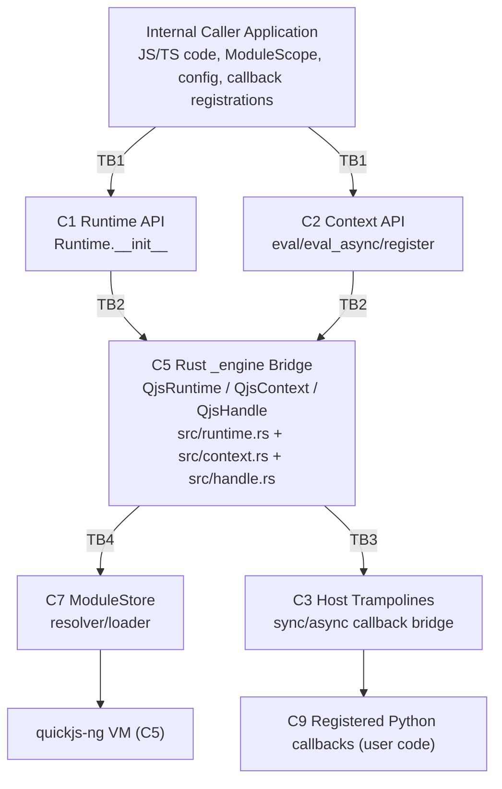

# Threat Model: quickjs-rs

> Generated: 2026-04-23 | Commit: bc2d9cb | Scope: Runtime execution engine and Python/Rust bridge for quickjs-rs

> **Disclaimer:** This threat model is automatically generated to help developers and security researchers understand where trust is placed in this system and where boundaries exist. It is experimental, subject to change, and not an authoritative security reference — findings should be validated before acting on them. The analysis may be incomplete or contain inaccuracies. We welcome suggestions and corrections to improve this document.

## Table of Contents

- [Scope](#scope)
- [System Overview](#system-overview)
- [Components](#components)
- [Data Classification](#data-classification)
- [Trust Boundaries](#trust-boundaries)
- [Data Flows](#data-flows)
- [Threats](#threats)
- [Input Source Coverage](#input-source-coverage)
- [Out-of-Scope Threats](#out-of-scope-threats)
- [Investigated and Dismissed](#investigated-and-dismissed)
- [Supply Chain and Upstream Dependency Debrief (Addendum)](#supply-chain-and-upstream-dependency-debrief-addendum)
- [Revision History](#revision-history)

## Scope

### In Scope

- `quickjs_rs/` Python API and orchestration layer.
- `src/` Rust `_engine` extension (runtime/context/handle/marshal/module loader/host fn bridge).
- Packaging/build dependency declarations that materially affect security behavior (`Cargo.toml`, `pyproject.toml`).

### Out of Scope

- `tests/`, `benchmarks/`, and `.codspeed/` benchmark harnesses.
- `toolchain/` vendored compiler artifacts.
- GitHub Actions operational controls in `.github/workflows/` (tracked as deployment/SDLC controls, not runtime library attack surface).

### Assumptions

1. Internal callers may pass sensitive business data, credentials, and user data through eval/callback paths.
2. The library itself does not persist state to disk or external databases; retention is process-memory bounded by runtime/context lifecycles.
3. Upstream dependency security response (quickjs-ng via `rquickjs`/`rquickjs-sys`, plus `oxidase`) is handled by repository maintainers.

---

## System Overview

`quickjs-rs` exposes a Python API (`Runtime`, `Context`, `Handle`, `ModuleScope`) backed by a Rust extension that embeds quickjs-ng (through `rquickjs`/`rquickjs-sys`) for JavaScript execution. Callers provide JS/TS source, register Python host callbacks, and optionally install in-memory ES module scopes. The Rust bridge performs marshaling and dispatch between Python and quickjs-ng, including async Promise settlement and cancellation behavior. Security posture depends on boundary enforcement at eval entry points, host callback registration, and module resolver isolation.

### Architecture Diagram



---

## Components

| ID | Component | Description | Trust Level | Default? | Entry Points |
|----|-----------|-------------|-------------|----------|--------------|
| C1 | Runtime API (`Runtime`) | Constructs runtime, sets memory/stack limits, installs module scopes. | framework-controlled | No (explicit opt-in required) | `quickjs_rs/runtime.py:Runtime.__init__`, `quickjs_rs/runtime.py:Runtime.install`, `quickjs_rs/runtime.py:Runtime.new_context` |
| C2 | Context API (`Context`) | Executes JS/module code, manages timeouts, async drive loop, and host registration. | framework-controlled | No (explicit opt-in required) | `quickjs_rs/context.py:Context.eval`, `quickjs_rs/context.py:Context.eval_async`, `quickjs_rs/context.py:Context.register` |
| C3 | Host callback bridge | Sync/async trampolines and pending resolver mapping between JS and Python callables. | framework-controlled | No (explicit opt-in required) | `src/context.rs:QjsContext::register_host_function`, `src/host_fn.rs:build_host_trampoline`, `src/host_fn.rs:dispatch_async_host_fn` |
| C4 | Module scope validation | Validates `ModuleScope` key/value shapes and required index entrypoints. | framework-controlled | No (explicit opt-in required) | `quickjs_rs/modules.py:ModuleScope.__post_init__` |
| C5 | Rust quickjs-ng bridge | Owns `QjsRuntime`/`QjsContext`/`QjsHandle` and executes quickjs-ng eval/module APIs. | framework-controlled | No (explicit opt-in required) | `src/runtime.rs:QjsRuntime::new`, `src/context.rs:QjsContext::eval`, `src/context.rs:QjsContext::eval_module_async` |
| C6 | Marshaling + handle boundary | Converts values across Python/JS and enforces cross-context handle identity. | framework-controlled | No (explicit opt-in required) | `src/marshal.rs:py_to_js_value`, `src/marshal.rs:js_value_to_py`, `quickjs_rs/handle.py:Handle._require_same_context` |
| C7 | Resolver/loader module store | In-memory module registry with scope-root path normalization and no filesystem loader. | framework-controlled | No (explicit opt-in required) | `src/modules.rs:resolve_with`, `src/modules.rs:normalize_path`, `src/modules.rs:StoreLoader::load` |
| C8 | Caller-provided JS/TS/module source | Untrusted or semi-trusted script content passed to eval/install APIs. | user-controlled | No (explicit opt-in required) | `quickjs_rs/context.py:Context.eval`, `quickjs_rs/context.py:Context.eval_async`, `quickjs_rs/runtime.py:Runtime._install_recursive` |
| C9 | Caller-provided Python callbacks | Python callables registered into JS global scope and invoked by JS code. | user-controlled | No (explicit opt-in required) | `quickjs_rs/context.py:Context.register`, `quickjs_rs/context.py:Context.function` |
| C10 | Upstream dependency surface | Embedded runtime/transpiler dependencies (`rquickjs`, quickjs-ng via `rquickjs-sys`, `oxidase`) executed inside process/build. | external | Yes (main package dependency) | `src/runtime.rs:QjsRuntime::new`, `src/modules.rs:maybe_strip_ts` |

---

## Data Classification

| ID | PII Category | Specific Fields | Sensitivity | Storage Location(s) | Encrypted at Rest | Retention | Regulatory |
|----|-------------|----------------|-------------|---------------------|-------------------|-----------|------------|
| DC1 | Credentials and secrets in callback payloads | `quickjs_rs/context.py:Context._dispatch_host_call(args)`, `quickjs_rs/context.py:Context._run_async_host_call(value)`, `src/context.rs:QjsContext::resolve_pending(value)` | Critical | Python heap (`_host_registry`, task locals), quickjs-ng heap values, pending resolver map (`src/context.rs:QjsContext.pending_resolvers`) | No (memory only) | Runtime/context lifetime; can extend while handles/promises remain live | Internal secrets policy, SOC2 controls |
| DC2 | User and tenant data embedded in JS/module source | `quickjs_rs/context.py:Context.eval(code)`, `quickjs_rs/context.py:Context.eval_async(code)`, `src/runtime.rs:QjsRuntime::add_module_source(source)` | High | quickjs-ng runtime heap, module source map (`src/modules.rs:ModuleStore.sources`) | No (memory only) | Runtime lifetime until `Runtime.close` or process exit | GDPR/CCPA (when source embeds personal data) |
| DC3 | Diagnostic error data and stack traces | `quickjs_rs/context.py:Context._run_async_host_call(err_message, err_stack)`, `src/context.rs:QjsContext::reject_pending(stack)`, `src/errors.rs:js_error_from_caught` | High | Python exceptions, JS `Error.stack`, upstream service logs if surfaced by caller | No (memory/log dependent) | Until exception handling/log retention policy in caller | GDPR/CCPA if stacks include personal data |
| DC4 | Execution policy metadata | `quickjs_rs/runtime.py:Runtime.__init__(memory_limit, stack_limit)`, `quickjs_rs/context.py:Context.__init__(timeout)`, `quickjs_rs/modules.py:ModuleScope.modules` keys | Low | Python object fields and runtime config state | No (memory only) | Runtime/context lifetime | None |
| DC5 | In-memory object graph snapshots and handles | `src/handle.rs:QjsHandle.persistent`, `quickjs_rs/handle.py:Handle._engine_handle`, `src/host_fn.rs:PendingResolver` | Medium | Persistent JS handles and pending async resolver state | No (memory only) | Until explicit `dispose`/`close`/drop | Internal data handling policy |

### Data Classification Details

#### DC1: Credentials and secrets in callback payloads

- **Fields**: callback args/results in `quickjs_rs/context.py:Context._dispatch_host_call`, async callback results in `quickjs_rs/context.py:Context._run_async_host_call`, settlement values in `src/context.rs:QjsContext::resolve_pending`.
- **Storage**: Python callback registry and task state (`quickjs_rs/context.py:Context._host_registry`, `quickjs_rs/context.py:Context._pending_tasks`), quickjs-ng values restored from `src/handle.rs:QjsHandle.persistent_clone`.
- **Access**: any registered callback and eval path that can reach `src/host_fn.rs:call_host_fn` / `src/host_fn.rs:dispatch_async_host_fn`.
- **Encryption**: none in library memory.
- **Retention**: bounded by `quickjs_rs/context.py:Context.close` and `quickjs_rs/handle.py:Handle.dispose`, but can become effectively long-lived for long-running runtimes.
- **Logging exposure**: callback exceptions serialized with traceback in `quickjs_rs/context.py:Context._run_async_host_call`.
- **Cross-border**: not directly managed by this library; caller service may transmit resulting data.
- **Gaps**: no built-in secret redaction on callback results or exception payloads.

#### DC2: User and tenant data embedded in JS/module source

- **Fields**: `code` in `quickjs_rs/context.py:Context.eval` / `quickjs_rs/context.py:Context.eval_async`; module source payload in `src/runtime.rs:QjsRuntime::add_module_source`.
- **Storage**: module registry `src/modules.rs:ModuleStore.sources`, quickjs-ng execution context via `src/context.rs:QjsContext::eval` / `src/context.rs:QjsContext::eval_module_async`.
- **Access**: any context sharing runtime module store (`quickjs_rs/runtime.py:Runtime.install` notes shared store semantics).
- **Encryption**: none in-memory.
- **Retention**: until runtime close (`quickjs_rs/runtime.py:Runtime.close`).
- **Logging exposure**: parser/eval errors surface message text via `src/errors.rs:js_error_from_caught`.
- **Cross-border**: governed by caller architecture; library does not enforce data residency.
- **Gaps**: no tenancy partitioning when one runtime is reused across trust domains.

#### DC3: Diagnostic error data and stack traces

- **Fields**: `err_message`, `err_stack` in `quickjs_rs/context.py:Context._run_async_host_call`; rejection fields in `src/context.rs:QjsContext::reject_pending`.
- **Storage**: Python exception objects and JS exception objects (`src/host_fn.rs:throw_host_error`).
- **Access**: JS caller reading rejection reason through `src/context.rs:QjsContext::promise_result`; Python caller catching `quickjs_rs/errors.py:HostError`.
- **Encryption**: none by default.
- **Retention**: depends on caller log/error handling pipelines.
- **Logging exposure**: high likelihood if caller logs JS/Python exceptions verbatim.
- **Cross-border**: if internal services forward errors to centralized logging/SIEM.
- **Gaps**: no default stack/message sanitization before rejection propagation.

---

## Trust Boundaries

| ID | Boundary | Description | Controls (Inside) | Does NOT Control (Outside) |
|----|----------|-------------|-------------------|---------------------------|
| TB1 | Internal caller -> Python API | External inputs first enter framework-controlled APIs. | Input routing and lifecycle checks in `quickjs_rs/runtime.py:Runtime.new_context`, `quickjs_rs/context.py:Context.eval`, `quickjs_rs/modules.py:ModuleScope.__post_init__` | Caller trust level, data quality, callback behavior, module source provenance |
| TB2 | Python orchestration -> Rust/quickjs-ng runtime | Python values/code cross into native quickjs-ng execution and marshaling. | Conversion constraints in `src/marshal.rs:py_to_js_value`, timeout/deadline wiring in `quickjs_rs/context.py:Context.eval`, handle identity checks in `src/handle.rs:QjsHandle::set` | Memory safety of upstream engine internals and all JS semantics |
| TB3 | quickjs-ng script execution -> Python host callbacks | JS-invoked function calls cross into arbitrary Python code. | Registration and trampoline hooks in `quickjs_rs/context.py:Context.register`, `src/context.rs:QjsContext::register_host_function`, `src/host_fn.rs:call_host_fn` | Side effects of callback implementation, secret access done by callback, downstream I/O |
| TB4 | Module specifier -> in-memory module store | Import specifiers resolve only within declared scope graph. | Scope-root enforcement in `src/modules.rs:normalize_path`, namespace separation in `src/modules.rs:resolve_with`, in-memory loading in `src/modules.rs:StoreLoader::load` | Correctness/safety of module source text itself |
| TB5 | Async task scheduler -> pending resolver state | Async callback completion crosses event-loop scheduling into JS Promise settlement. | Pending map bookkeeping in `src/host_fn.rs:dispatch_async_host_fn`, cleanup in `quickjs_rs/context.py:Context._run_async_host_call`, resolver settle in `src/context.rs:QjsContext::resolve_pending` | External event loop latency/fairness and callback completion guarantees |
| TB6 | Project code -> third-party dependencies | Build/runtime behavior depends on upstream crates and embedded engines. | Pinning strategy and integration points (`Cargo.toml`, `src/modules.rs:maybe_strip_ts`, `src/runtime.rs:QjsRuntime::new`) | Upstream dependency compromise, undisclosed engine vulnerabilities |

### Boundary Details

#### TB1: Internal caller -> Python API

- **Inside**: context/runtime closed checks and explicit API invocation model (`quickjs_rs/runtime.py:Runtime.new_context`, `quickjs_rs/context.py:Context.eval`).
- **Outside**: caller may supply untrusted JS, oversized payloads, or dangerous callbacks.
- **Crossing mechanism**: direct Python method calls.

#### TB2: Python orchestration -> Rust/quickjs-ng runtime

- **Inside**: marshal depth cap and type gating (`src/marshal.rs:MAX_MARSHAL_DEPTH`, `src/marshal.rs:js_value_to_py`), sync/async eval guard flags (`quickjs_rs/context.py:Context._eval_and_drive`, `src/context.rs:QjsContext::take_sync_eval_hit_async_call`).
- **Outside**: native engine internals in quickjs-ng via `rquickjs`/`rquickjs-sys`.
- **Crossing mechanism**: PyO3 FFI calls through `_engine` (`src/lib.rs:_engine`).

#### TB3: quickjs-ng execution -> Python callbacks

- **Inside**: callback registration and dispatch path (`quickjs_rs/context.py:Context.register`, `src/host_fn.rs:call_host_fn`, `src/host_fn.rs:dispatch_async_host_fn`).
- **Outside**: callback implementation safety and side effects (filesystem/network/database usage in caller code).
- **Crossing mechanism**: JS function invocation via generated trampoline functions.

#### TB4: Module specifier -> in-memory module store

- **Inside**: relative path normalization and subscope matching (`src/modules.rs:normalize_path`, `src/modules.rs:resolve_with`).
- **Outside**: module content trust and business logic correctness.
- **Crossing mechanism**: quickjs-ng resolver/loader callbacks exposed through `rquickjs`.

#### TB5: Async scheduler -> pending resolver state

- **Inside**: pending ID registration/removal and cancellation rejection (`src/context.rs:QjsContext::reject_pending`, `quickjs_rs/context.py:Context._reject_pending_with_cancellation`).
- **Outside**: scheduling conditions and callback execution timing.
- **Crossing mechanism**: asyncio task completion and Promise settlement callbacks.

#### TB6: Project code -> third-party dependencies

- **Inside**: dependency selection and pinned revisions.
- **Outside**: dependency maintainer security posture and unknown CVEs.
- **Crossing mechanism**: build-time fetch and runtime linking/execution.

---

## Data Flows

| ID | Source | Destination | Data Type | Classification | Crosses Boundary | Protocol |
|----|--------|-------------|-----------|----------------|------------------|----------|
| DF1 | C8 | C2 | JS source text passed to eval APIs | DC2 | TB1 | Python function call (`Context.eval*`) |
| DF2 | C8 | C4 | ModuleScope dictionaries and source strings | DC2 | TB1 | Python object graph (`Runtime.install`) |
| DF3 | C4 | C7 | Canonicalized module entries/subscope registrations | DC2 | TB2 | PyO3 call to `QjsRuntime.add_module_source` / `register_subscope` |
| DF4 | C2 | C5 | Eval requests with timeout/deadline and module/script mode flags | DC2, DC4 | TB2 | PyO3 call to `QjsContext.eval*` |
| DF5 | C7 | C5 | Resolved module path and source retrieval for `import` | DC2 | TB4 | quickjs-ng resolver/loader callback |
| DF6 | C9 | C3 | Callback metadata (`fn_id`, sync/async mode, name) during registration | DC1 | TB1 | Python API + trampoline install |
| DF7 | C8 | C9 | Sync host callback args/results crossing JS -> Python -> JS | DC1 | TB3 | Trampoline dispatch (`call_host_fn`) |
| DF8 | C8 | C9 | Async host callback args/results via pending Promise IDs | DC1 | TB3 | Async trampoline + asyncio task settlement |
| DF9 | C9 | C8 | Exception names/messages/stacks propagated back to JS/Python | DC3 | TB3 | Promise reject / JS throw propagation |
| DF10 | C2/C6 | C5 | Marshaled Python objects and handles crossing into quickjs-ng heap | DC1, DC5 | TB2 | `py_to_js_value` / handle restore |
| DF11 | C10 | C5 | External dependency behavior executed in transpile/runtime paths | DC5 | TB6 | Build/runtime dependency load |

### Flow Details

#### DF1: C8 -> C2

- **Data**: arbitrary script/module text, often business data embedded in strings.
- **Validation**: only lifecycle checks (`quickjs_rs/context.py:Context.eval` checks `_closed`); no source trust policy.
- **Trust assumption**: caller enforces provenance/tenant isolation for script inputs.

#### DF7: C8 -> C9

- **Data**: JS-controlled arguments passed to registered Python callback.
- **Validation**: marshaling/type conversion in `src/host_fn.rs:call_host_fn` and `src/marshal.rs:js_value_to_py`; no semantic allowlist.
- **Trust assumption**: registered callback is safe for arbitrary argument values.

#### DF8: C8 -> C9

- **Data**: async callback args/results and pending IDs.
- **Validation**: dispatcher existence check and task tracking in `quickjs_rs/context.py:Context._dispatch_async_host_call`; pending-settle guards in `src/context.rs:QjsContext::resolve_pending`.
- **Trust assumption**: pending ID map remains collision-free and callbacks complete.

#### DF11: C10 -> C5

- **Data**: dependency code paths and transpilation/runtime logic.
- **Validation**: pinned revision comment and usage constraints around `src/modules.rs:maybe_strip_ts`; no in-repo cryptographic verification.
- **Trust assumption**: upstream dependencies remain uncompromised and patched.

---

## Threats

| ID | Data Flow | Classification | Threat | Boundary | Severity | Status | Validation | Code Reference |
|----|-----------|----------------|--------|----------|----------|--------|------------|----------------|
| T1 | DF7, DF8 | DC1 | Untrusted JS can invoke privileged registered callbacks, enabling Python-side side effects (file/network/process access) equivalent to code execution through callback capabilities. | TB3 | Critical | Accepted (by design) | Verified | `quickjs_rs/context.py:Context.register`, `src/context.rs:QjsContext::register_host_function`, `src/host_fn.rs:call_host_fn` |
| T2 | DF1, DF4 | DC2, DC4 | CPU/memory denial-of-service when callers disable/raise limits (`memory_limit=None`, permissive timeout) while executing attacker-influenced scripts. | TB1 | High | Accepted with guardrails | Verified | `quickjs_rs/runtime.py:Runtime.__init__`, `src/runtime.rs:QjsRuntime::new`, `quickjs_rs/context.py:Context.eval`, `quickjs_rs/context.py:Context._eval_and_drive` |
| T3 | DF9 | DC3 | Host exception messages and tracebacks can leak secrets/paths into JS-visible errors and upstream logs. | TB3 | High | Mitigated (sanitized JS HostError payload) | Verified | `quickjs_rs/context.py:Context._dispatch_host_call`, `quickjs_rs/context.py:Context._run_async_host_call`, `src/host_fn.rs:dispatch_async_host_fn` |
| T4 | DF1, DF4, DF11 | DC2, DC5 | Native engine vulnerability risk: attacker-controlled JS reaches embedded quickjs-ng execution path via `rquickjs`; upstream memory safety flaws could lead process compromise. | TB2, TB6 | Critical | Accepted (architectural) | Unverified | `src/context.rs:QjsContext::eval`, `src/context.rs:QjsContext::eval_module_async`, `src/runtime.rs:QjsRuntime::new` |
| T5 | DF11 | DC5 | Build/runtime supply-chain compromise risk from external dependency code paths (`oxidase` transpilation and engine crates). | TB6 | High | Accepted | Likely | `src/modules.rs:maybe_strip_ts`, `src/runtime.rs:QjsRuntime::new` |
| T6 | DF8 | DC1, DC5 | `pending_id` wraparound (`u32::wrapping_add`) can collide with unresolved entries, potentially misrouting async Promise settlements under extreme long-lived load. | TB5 | Medium | Mitigated (collision-safe allocator) | Verified | `src/host_fn.rs:dispatch_async_host_fn`, `src/host_fn.rs:find_available_pending_id`, `src/context.rs:QjsContext::resolve_pending` |
| T7 | DF2, DF3, DF5 | DC2 | Runtime-level shared module store can allow cross-tenant module poisoning if one runtime serves multiple trust domains (multi-tenant pooled-runtime pattern). | TB1, TB4 | High (conditional) | Accepted (documented constraint) | Likely | `quickjs_rs/runtime.py:Runtime.install`, `quickjs_rs/runtime.py:Runtime._install_recursive`, `src/runtime.rs:QjsRuntime::ensure_module_store` |
| T8 | DF7, DF10 | DC2, DC5 | Reentrant eval across sibling contexts on one runtime can run against the wrong context identity, causing cross-context read/write contamination. | TB2, TB3 | High | Mitigated (requested-context enforcement) | Verified | `src/reentrance.rs:with_active_ctx`, `tests/test_reentrance.py` |

### Threat Details

#### T1: Privileged callback abuse from JS

- **Flow**: DF7/DF8 (C8 -> C9 through C3).
- **Description**: any callback registered into `globalThis` is callable by JS; if callback exposes sensitive capabilities, attacker-controlled JS can invoke them.
- **Preconditions**: untrusted JS reaches `Context.eval*`; at least one privileged callback is registered.
- **Mitigations**: explicit callback registration only (`quickjs_rs/context.py:Context.register`), no implicit host APIs; recommended least-privilege callback design and allowlisting.
- **Residual risk**: high by design when callbacks intentionally bridge to host resources; acceptable only with explicit capability policy and isolation for untrusted code.

#### T2: Resource exhaustion under permissive limits

- **Flow**: DF1/DF4.
- **Description**: attacker script loops/allocates aggressively; if limits are relaxed, execution can starve worker capacity.
- **Preconditions**: caller deliberately overrides default limits/timeout or sets unbounded values (`memory_limit=None`, permissive timeout).
- **Mitigations**: default runtime caps (`quickjs_rs/runtime.py:Runtime.__init__`), interrupt deadline checks (`quickjs_rs/runtime.py:Runtime.__init__` interrupt closure, `quickjs_rs/context.py:Context.eval`), and deployment guardrails that disallow unbounded settings for untrusted execution.
- **Residual risk**: medium when guardrails are enforced; high if operators permit unbounded/relaxed limits.

#### T3: Error-channel information disclosure

- **Flow**: DF9.
- **Description**: callback exceptions include message/traceback that can surface to JS error objects and upstream service logs.
- **Preconditions**: callback throws with sensitive content in message/stack; caller exposes error payload.
- **Mitigations**: JS-visible host callback failures are sanitized to a stable `HostError` message (`"Host function failed"`) for both sync and async dispatch paths.
- **Residual risk**: medium; original Python exception details remain available in Python (`HostError.__cause__`) and can still leak if callers log them verbatim.

#### T4: Native engine exploitability path

- **Flow**: DF1/DF4/DF11.
- **Description**: attacker input is parsed/executed by embedded native quickjs-ng engine (through `rquickjs`); unknown upstream flaws may be exploitable.
- **Preconditions**: attacker-controlled script reaches eval, and an exploitable upstream bug exists.
- **Mitigations**: dependency pinning/review plus memory/stack/timeout controls reduce DoS blast radius; they do not remove memory-corruption class vulnerability potential.
- **Residual risk**: critical architectural dependency risk; accepted with compensating controls (isolated execution mode for untrusted code, patch cadence, and dependency monitoring).

#### T5: Supply-chain compromise in dependency path

- **Flow**: DF11.
- **Description**: compromised dependency artifacts or malicious upstream commits affect transpile/runtime behavior.
- **Preconditions**: dependency source compromised before/at build.
- **Mitigations**: commit pinning for `oxidase` (non-floating branch), explicit dependency declarations, RustSec advisory scanning in CI (`.github/workflows/dependency-security.yml`), and Cargo.lock git-source allowlist enforcement (`.github/scripts/check_cargo_lock_git_sources.py`).
- **Residual risk**: high; pinning alone does not guarantee artifact integrity.

#### T6: Async pending ID collision

- **Flow**: DF8.
- **Description**: wraparound IDs can overwrite unresolved resolver entries and settle wrong Promise.
- **Preconditions**: very long-lived process, high async callback volume, unresolved entries still present near wrap.
- **Mitigations**: collision-safe pending ID allocation scans for a free slot before insert and rejects cleanly if ID space is exhausted; regression tests cover free, occupied, and wraparound paths.
- **Residual risk**: low; remaining risk is bounded to extreme full-ID-space exhaustion conditions.

#### T8: Reentrant cross-context identity confusion

- **Flow**: DF7/DF10.
- **Description**: reentrant eval chains in sibling contexts sharing one runtime can execute against an unintended context identity if reentrance routing uses the wrong context pointer.
- **Preconditions**: nested host-callback-driven eval occurs while runtime lock is active, and reentrance routing does not preserve requested context identity.
- **Mitigations**: reentrance path enforces requested-context identity via `with_active_ctx`, using runtime-active tracking with per-call context pointer restoration; sync/async cross-context regression tests validate read/write isolation.
- **Residual risk**: low; future refactors in reentrance routing must preserve current invariants and test coverage.

#### T7: Shared runtime module poisoning

- **Flow**: DF2/DF3/DF5.
- **Description**: modules installed on one runtime become importable by any context on that runtime, enabling trust-domain cross-contamination in pooled-runtime multi-tenant designs.
- **Preconditions**: runtime shared across tenants/users with differing trust.
- **Mitigations**: documented deployment constraint: use one `Runtime` per trust domain (no cross-tenant shared runtime).
- **Residual risk**: high in pooled-runtime multi-tenant designs; not applicable when deployments enforce runtime-per-trust-domain.

### Threat Chain Analysis

- **TC1 (T7 + T1)**: in pooled-runtime multi-tenant deployments, cross-tenant module poisoning can seed hostile helper code, then invoke privileged callback paths for lateral movement.
- **TC2 (T3 + T1)**: callback abuse can still trigger sensitive failures; JS payloads are sanitized, but Python-side logging of underlying causes can still amplify exposure if not controlled.
- **TC3 (T8 + T1)**: if reentrant context identity were to regress, callback-assisted cross-context eval could become a tenant-isolation bypass path on shared-runtime deployments.

---

## Input Source Coverage

| Input Source | Data Flows | Threats | Validation Points | Responsibility | Gaps |
|-------------|-----------|---------|-------------------|----------------|------|
| User direct input (JS code, module source, values) | DF1, DF2, DF10 | T1, T2, T4, T7 | `quickjs_rs/context.py:Context.eval`, `quickjs_rs/modules.py:ModuleScope.__post_init__`, `src/marshal.rs:py_to_js_value` | project | No provenance/trust policy enforcement at eval/install boundary |
| Tool/function results (registered callbacks) | DF7, DF8, DF9 | T1, T3, T6, T8 | `src/host_fn.rs:call_host_fn`, `quickjs_rs/context.py:Context._run_async_host_call`, `src/context.rs:QjsContext::resolve_pending`, `src/reentrance.rs:with_active_ctx` | project | JS-visible callback errors are sanitized by default; Python-side exception logging policy remains caller responsibility |
| Configuration (limits/timeouts/module topology) | DF1, DF3, DF4 | T2, T7 | `quickjs_rs/runtime.py:Runtime.__init__`, `src/runtime.rs:QjsRuntime::new`, `src/modules.rs:resolve_with` | project | Safe defaults exist, but unsafe overrides are not blocked |
| LLM output (only when caller forwards to eval) | DF1 | T1, T2, T4 | Same as user direct input path | project | No distinct guardrails for model-generated code payloads |

---

## Out-of-Scope Threats

| Pattern | Why Out of Scope | Project Responsibility Ends At |
|---------|------------------|-------------------------------|
| Vulnerabilities in callback implementation logic | Callback code is provided by consuming application, not this repository. | `quickjs_rs/context.py:Context.register` (registration mechanism only) |
| Host OS/container hardening failures | Process isolation, kernel policy, and host network egress controls are deployment concerns. | `src/lib.rs:_engine` (library execution boundary) |

### Rationale

Callback-level vulnerabilities are constrained by this library only at the invocation contract level; side-effect safety belongs to caller-owned callback code. Similarly, OS/container controls are not configured by this package and must be enforced by deployment infrastructure.

---

## Investigated and Dismissed

| ID | Original Threat | Investigation | Evidence | Conclusion |
|----|----------------|---------------|----------|------------|
| D1 | Relative import path traversal could read arbitrary filesystem files. | Traced resolver and loader path from `import` specifier through normalization and source fetch. | `src/modules.rs:normalize_path`, `src/modules.rs:resolve_with`, `src/modules.rs:StoreLoader::load` | Disproven: loader fetches only `ModuleStore.sources` in-memory entries; no filesystem read path exists. |
| D2 | Cross-context handle confusion allows reading/writing values across contexts. | Traced handle context ID checks, promise APIs for context-pointer validation before restore, and reentrant context identity routing. | `quickjs_rs/handle.py:Handle._require_same_context`, `src/marshal.rs:handle_or_py_to_js`, `src/context.rs:QjsContext::promise_state`, `src/reentrance.rs:with_active_ctx`, `tests/test_reentrance.py` | Disproven for handle marshaling path; reentrant context-identity risk is tracked separately as T8 and currently mitigated. |

---

## Supply Chain and Upstream Dependency Debrief (Addendum)

This section is the dependency-risk and sandbox-boundary addendum consolidated into the main threat model. It complements T4 and T5 with explicit upstream-chain evidence, maintenance status, and deployment acceptability criteria.

### Purpose and Scope

In scope:
- Rust dependency chain (`pyo3`, `rquickjs`, `rquickjs-core`, `rquickjs-sys`, `oxidase` + transitive graph).
- Runtime isolation properties of embedded quickjs-ng execution in this project.
- Practical maintenance/adoption signals for upstream risk posture.

Out of scope:
- Full CVE-by-CVE triage for every transitive crate.
- Build pipeline hardening outside this repository.

### Verified Dependency Chain

#### Direct and critical transitive runtime dependencies

| Dependency | Version / Source | Role | Evidence |
|---|---|---|---|
| `pyo3` | `0.28.3` (crates.io) | Python C-API bridge for Rust extension module | `Cargo.lock` package entries at `name = "pyo3"` and `name = "pyo3-ffi"` (`Cargo.lock`:598-628) |
| `rquickjs` | `0.11.0` (crates.io) | Rust API wrapper over quickjs-ng | `Cargo.lock`:717-735 and `rquickjs` README (`docs.rs`) |
| `rquickjs-sys` | `0.11.0` (crates.io) | Low-level native bindings used by `rquickjs` | `Cargo.lock`:738-744 |
| `quickjs-ng` | Transitive native engine source bundled via `rquickjs-sys` (not a direct Cargo package entry) | JavaScript VM compiled into the extension module | `rquickjs` README states quickjs-ng backing; `rquickjs-sys` bundled engine source tree (`quickjs/*`) |
| `oxidase` | git rev `045ea46...` | TypeScript stripping at install time | `Cargo.toml` dependency pin; `Cargo.lock`:497-519 |

#### Chain topology

```text
quickjs-rs-python
  -> rquickjs
    -> rquickjs-core
      -> rquickjs-sys
        -> vendored quickjs-ng C engine sources
          -> compiled into `_engine` native module
  -> pyo3
    -> pyo3-ffi
  -> oxidase (git rev)
    -> oxc* transitive dependencies (git branch in lockfile)
```

Evidence:
- `cargo tree -e normal -p quickjs-rs-python`
- `Cargo.lock`:497-519, 598-628, 717-744
- docs.rs crate source listing for `rquickjs-sys` includes bundled engine sources (`quickjs.c`, `quickjs.h`, `quickjs-libc.c`): <https://docs.rs/crate/rquickjs-sys/latest/source/quickjs/quickjs-atom.h>
- `rquickjs` README states the crate is a high-level binding of quickjs-ng: <https://docs.rs/crate/rquickjs/latest/source/README.md>
- quickjs-ng upstream repository/releases: <https://github.com/quickjs-ng/quickjs>

### Supply Chain Risk Assessment

| Risk | Why it applies here | Current control | Residual risk |
|---|---|---|---|
| Native engine memory-safety risk | JS is executed by embedded native engine (quickjs-ng via `rquickjs-sys`) in-process. | Runtime limits and interrupt handler in project code (`src/runtime.rs:QjsRuntime::new`, `QjsRuntime::set_interrupt_handler`) | High |
| Compromised upstream release (crates.io) | `pyo3`/`rquickjs`/`rquickjs-sys` come from registry artifacts. | `Cargo.lock` pinning by version + checksum | Medium |
| Compromised quickjs-ng upstream import path | quickjs-ng source is vendored inside the `rquickjs-sys` supply path; an upstream compromise or malicious import/update can enter runtime engine code. | Version pinning of `rquickjs-sys` crate and lockfile review | Medium-High |
| Compromised git dependency | `oxidase` comes from git commit; transitive `oxc*` sources are git-based in lockfile. | Explicit commit pin for `oxidase` plus git-source allowlist checks in CI (`.github/scripts/check_cargo_lock_git_sources.py`) | Medium |
| Silent transitive drift on lock update | Lock refresh can pull new transitive versions/commits. | CI gate fails on unexpected git-source introductions outside allowlist | Medium |
| Vulnerability lag | New advisories can emerge for shipped versions after lockfile updates. | Always-on RustSec scan in CI (`cargo audit`) plus Dependabot/GitHub alerts | Medium |

### Upstream Maintenance Status (Snapshot: 2026-04-23)

| Upstream | Status Signal | Practical Read |
|---|---|---|
| quickjs-ng | quickjs-ng repository shows active releases (for example `v0.14.0` on 2026-04-11). | Actively released upstream C engine fork, but still native in-process risk. |
| `rquickjs` / `rquickjs-sys` | `rquickjs` 0.11.0 release (2025-12-24); repository metadata current at snapshot time. | Wrapper and bindings appear actively maintained. |
| PyO3 | `pyo3` 0.28.3 release (2026-04-02); repository metadata current at snapshot time. | Mature, high-velocity bridge ecosystem. |
| `oxidase` (git dep) | Pinned commit date 2025-02-09; smaller maintainer footprint than PyO3/rquickjs. | Higher governance risk than large crates.io projects; pinning helps reproducibility, not compromise resistance. |

Notes:
- `rquickjs-sys` carries bundled engine sources and local patches, which is useful but increases divergence-tracking responsibility for consumers.
- Maintenance activity is a confidence signal, not a security guarantee.

### Industry Adoption Signals

- **AWS**: `awslabs/llrt` states LLRT uses QuickJS and its core crate depends on `rquickjs` (which documents quickjs-ng backing).
- **Shopify**: Shopify engineering write-up on Javy describes Rust wrappers around a QuickJS-family engine for Shopify Functions.
- **ByteDance/TikTok ecosystem**: Lynx docs and `lynx-family/primjs` describe PrimJS as QuickJS-based.

Interpretation:
- Adoption by large organizations supports operational viability.
- It does not change the trust-boundary conclusion that embedded quickjs-ng is in-process native execution.

### Memory Sandbox

This dependency chain **does not provide a process-level host-memory sandbox**.

quickjs-ng and PyO3 code execute in the same process/address space as host Python code. This repository adds resource controls (limits/timeouts), not memory isolation.

Evidence:
- Runtime memory and stack limits are set in `src/runtime.rs:QjsRuntime::new` (`set_memory_limit`, `set_max_stack_size`).
- Timeout behavior is interrupt-handler based in `src/runtime.rs:QjsRuntime::set_interrupt_handler` and Python deadline wiring in `quickjs_rs/runtime.py:Runtime.__init__`.
- Extension is in-process native module (`Cargo.toml` `crate-type = ["cdylib"]`; `pyproject.toml` `_engine` module).
- `rquickjs` documents quickjs-ng backing and `Runtime` control APIs (memory limit, stack limit, interrupt handling), which are guard APIs rather than process isolation.
- The engine-level C APIs (`JS_SetMemoryLimit`, `JS_SetMaxStackSize`, `JS_SetInterruptHandler`) are compatibility guard hooks, not process isolation boundaries.
- `pyo3::ffi` documents raw CPython FFI safety constraints consistent with in-process native execution.

### Existing Mitigations in This Repo

- Default memory cap: `64 MiB` (`quickjs_rs/runtime.py:Runtime.__init__`).
- Default stack cap: `1 MiB` (`quickjs_rs/runtime.py:Runtime.__init__`).
- Per-eval deadline interrupt (`quickjs_rs/runtime.py:Runtime.__init__`, `src/runtime.rs:QjsRuntime::set_interrupt_handler`).
- Context/handle boundary checks (`src/handle.rs:QjsHandle::set`, `quickjs_rs/handle.py:Handle._require_same_context`).
- In-memory module loader (`src/modules.rs:StoreLoader::load`) reduces filesystem import exposure.

These mitigate DoS and misuse classes, but do not isolate host memory from native engine memory-corruption classes.

### Recommended Additional Mitigations

For untrusted or semi-trusted JS in internal deployments:

1. Run quickjs-ng execution in isolated worker processes/containers, not in primary app process.
2. Apply OS isolation controls (seccomp/AppArmor/SELinux, restricted egress, no metadata service access, read-only filesystem where feasible).
3. Enforce callback capability policy (least privilege; no direct shell/network/fs callbacks unless explicitly required).
4. Kill and recycle workers on timeout/OOM/suspicious failures.
5. Keep dependency policy gates in CI current (`cargo audit`, Cargo.lock git-source allowlist checks, lockfile review discipline).
6. Add immutable provenance checks for git dependencies (commit allowlist/signature verification where feasible).

### Acceptability and Policy Position

Current architecture is acceptable only under one of these modes:

- Trusted-code mode: only trusted internal JS/callback code executes, and process-compromise blast radius is bounded by host controls.
- Untrusted-code mode: execution is isolated behind disposable low-privilege workers.

Policy phrasing:
- Allowed claim: "Resource-constrained embedded JS runtime with timeout/memory guards."
- Disallowed claim: "Memory sandbox" or "host-memory isolation from quickjs-ng runtime."
- Threat-model convention: an "Accepted" threat indicates explicit risk ownership and compensating controls, not a defect omission.

### Sources

- quickjs-ng: <https://quickjs-ng.github.io/quickjs/> and <https://github.com/quickjs-ng/quickjs>
- `rquickjs` docs and release stream: <https://docs.rs/rquickjs/latest/rquickjs/> and <https://docs.rs/crate/rquickjs/latest>
- `rquickjs` README source (quickjs-ng statement): <https://docs.rs/crate/rquickjs/latest/source/README.md>
- `rquickjs-sys` overview and bundled-source listing: <https://docs.rs/crate/rquickjs-sys/latest> and <https://docs.rs/crate/rquickjs-sys/latest/source/quickjs/quickjs-atom.h>
- Original QuickJS reference docs (API lineage context): <https://bellard.org/quickjs/> and <https://bellard.org/quickjs/quickjs.html>
- PyO3 FFI docs and releases: <https://docs.rs/pyo3/latest/pyo3/ffi/index.html> and <https://docs.rs/crate/pyo3/latest>
- AWS LLRT: <https://github.com/awslabs/llrt>
- Shopify engineering (Javy/QuickJS-family): <https://shopify.engineering/javascript-in-webassembly-for-shopify-functions>
- Lynx / PrimJS: <https://lynxjs.org/guide/scripting-runtime/main-thread-runtime.html> and <https://github.com/lynx-family/primjs>

---

## Revision History

| Date | Author | Changes |
|------|--------|---------|
| 2026-04-23 | generated by langster-threat-model | Initial deep internal threat model for quickjs-rs with data classification, trust boundaries, input source coverage, validated threats, and dismissed hypotheses. |
